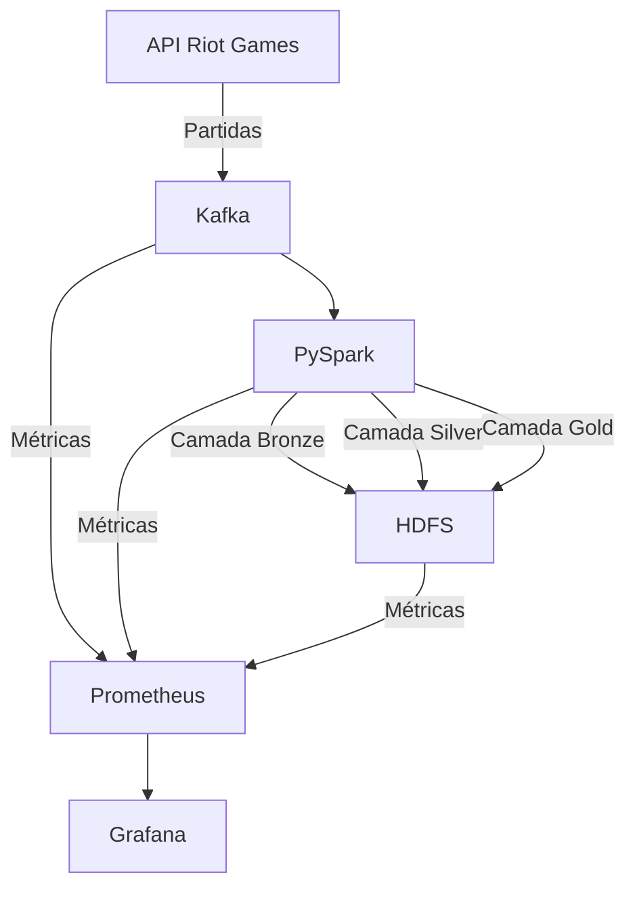

O repositório "datamaster" é um projeto do programa Data Master organizado pela F1rst Santander. 

# **Relatório Técnico**

## **I. Objetivo do Case**

O objetivo do case é desenvolver uma solução de engenharia de dados para consumir informações de partidas do jogo **League of Legends** em tempo real utilizando a API oficial da Riot Games. O fluxo de dados deve ser processado e armazenado em um **Data Lake**, estruturado em camadas (`bronze`, `silver`, `gold`). Além disso, a solução deve permitir **monitoramento** e **observabilidade**, garantindo a rastreabilidade do fluxo de dados, detecção de falhas e identificação de gargalos de desempenho.

### **Inicio Rapido**

#### **1 - Conta Developer Riot**
   
   - Crie uma conta no portal [Riot Games](https://authenticate.riotgames.com/?client_id=riot-developer-portal&locale=en_US&method=riot_identity_signup&platform=web&redirect_uri=https%3A%2F%2Fauth.riotgames.com%2Fauthorize%3F_gl%3D1*mmhe2r*_ga*NTQ4MTM1NzkxLjE3Mjc4MzIwMzQ.*_ga_0X9JWXB87B*MTczMzMzMjQ4OS41LjAuMTczMzMzMjQ5MC4wLjAuMA..%26client_id%3Driot-developer-portal%26prompt%3Dsignup%26redirect_uri%3Dhttps%3A%2F%2Fdeveloper.riotgames.com%2Foauth2-callback%26response_type%3Dcode%26scope%3Dopenid%2520email%2520summoner%26ui_locales%3Den-US)
   - Faça a verificação do email cadastrado
   - Aceite os termos
   - Crie de fato a conta de developer
   - Acesse o link [Developer Portal](https://developer.riotgames.com/)
   - Gere uma nova chave da API

#### **2 - Configurando o Ambiente**

Se o sistema operacional for linux ou mac - utilize o seguinte comando substituindo a CHAVE_API pela chave gerada
``` 
make replace REPLACE_STRING=CHAVE_API
```

Se utilizar windows utilize o comando reclace (ctrl + shift + r) para substituir CHAVE_API pela chave gerada 

Necessário ter docker e docker compose configurado

#### **3 - Configurando o Ambiente**
   - Execute o comando 
```
   ./start_services.sh;
``` 

Com isso todos os serviços devem estar sendo executados sem problemas
---

## **II. Arquitetura de Solução e Arquitetura Técnica**

### **Arquitetura de Solução**

A solução foi projetada em um pipeline de dados com as seguintes etapas principais:

1. **Extração**:
   - Dados de partidas são consumidos da API da Riot Games.
   - As informações são enviadas para o tópico `summoners` no Kafka.

2. **Processamento em Tempo Real**:
   - Dados do Kafka são consumidos pelo PySpark.
   - Os dados são escritos na camada `bronze` do Data Lake.

3. **Transformação e Limpeza**:
   - Dados da camada `bronze` são processados e normalizados para a camada `silver`.

4. **Agregação**:
   - A camada `gold` é criada com agregações e métricas prontas para análise, como KPIs.

5. **Monitoramento**:
   - Métricas de todo o pipeline são monitorados usando Prometheus, Grafana.

---

### **Arquitetura Técnica**

**Tecnologias Utilizadas**:

| Tecnologia         | Função                                                      |
|--------------------|-------------------------------------------------------------|
| **Kafka**          | Sistema de mensageria para ingestão de dados em tempo real. |
| **Kafka Exporter** | Export as metricas do Kafka para o Prometheus               |
| **PySpark**        | Processamento distribuído de dados.                         |
| **HDFS**           | Armazenamento em Data Lake com suporte a grandes volumes.   |
| **Jupyther**       | Ambiente para exploração dos dados                          |
| **Airflow**        | Schedular Jobs                                              |
| **Prometheus**     | Coleta de métricas para monitoramento.                      |
| **Grafana**        | Visualização de métricas em dashboards.                     |
| **Docker Compose** | Orquestração dos serviços.                                  |

**Fluxo de Dados**:



---

## **III. Explicação sobre o Case Desenvolvido**

### **1. Extração de Dados**

O script [get_summoners_br.py](base/airflow/dags/get_summoners_br.py) consulta a API da Riot Games e esta agendado para executar de hora em hora, onde coleta os IDs do top 3 da região do brasil e envia informações sobre partidas para o tópico Kafka `summoners`.

O script streaming [kafka_summoner_details.py](base/riot/kafka_summoner_details.py) recebe o ID do jogador e buscas os IDs de das ultimas 3 partidas e envia esses IDs para o topico Kafka  `summoners_details`

O script streaming [kafka_matchs.py](base/riot/kafka_matchs.py) recebe o ID da partida e buscas as informações da partida e envia o json para o topico Kafka  `matchs`

### **2. Processamento de Dados**

O script [consumer_kafka_to_lake.py](base/riot/consumer_kafka_to_lake.py):
- Consome mensagens do Kafka em tempo real no topico  `match`.
- Escreve os dados brutos e as metricas de cada etapa na camada `bronze` do Data Lake em formato Parquet.
- Assegura tolerância a falhas com checkpoints.

O script [bronze_to_silver.py](base/airflow/dags/bronze_to_silver.py)
- DAG que consome a camada bronze e extrai e estrutura as informações mais relevantes.

O script [silver_to_gold.py](base/airflow/dags/silver_to_gold.py)
- DAG que consome a camada silver e realiza agregações.

### **3. Estrutura do Data Lake**

- **Camada Bronze**: Dados brutos conforme recebidos do Kafka.
- **Camada Silver**: Dados transformados e normalizados, por exemplo, extraindo estatísticas individuais dos jogadores.
- **Camada Gold**: Dados agregados, como KPIs (ex.: total de kills, mortes e assistências por jogador).

### **4. Monitoramento**

**Métricas**:
- Kafka, HDFS e Spark expõem métricas para o Prometheus, que são visualizadas no Grafana.

### **4. LGPD**

Para os dados que trabalhamos na API, não temos dados sensiveis.

Caso existise dados sensiveis poderiamos utilizar os metodos:
   - Generalização
   - Supressão
   - K-Anonimidade
   - Tokenização

---

## **IV. Melhorias e Considerações Finais**

### **Melhorias**

1. **Escalabilidade**:
   - Implementar particionamento no Kafka e paralelismo no PySpark para suportar maior volume de dados.
   - Configurar múltiplos nós no cluster HDFS para maior capacidade de armazenamento.

2. **Observabilidade Avançada**:
   - Adicionar rastreamento distribuído com OpenTelemetry para monitorar o tempo de processamento em cada componente do pipeline.

3. **Governança de Dados**:
   - Adicionar políticas de retenção em cada camada.

4. **Segurança**:
   - Configurar autenticação e autorização no Kafka.
   - Criptografar os dados sensíveis armazenados no Data Lake.
   - Chaves de API ser armazenadas em um cofre de senhas.

---

### **Considerações Finais**

A solução desenvolvida apresenta um pipeline robusto para ingestão, processamento e armazenamento de dados em tempo real, com suporte a monitoramento e observabilidade. As tecnologias utilizadas garantem escalabilidade e flexibilidade, atendendo às demandas do case.

Com as melhorias sugeridas, a solução pode ser ainda mais eficiente e confiável, garantindo maior governança e capacidade de lidar com volumes crescentes de dados.

---
