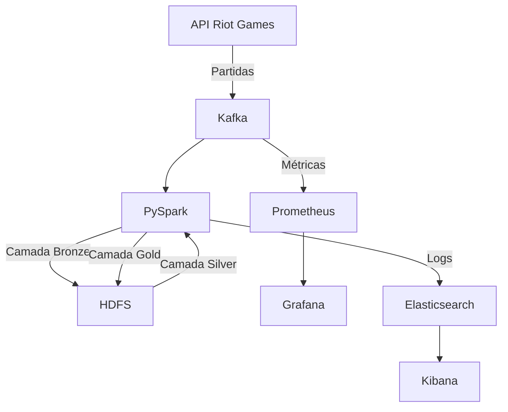

# **Relatório Técnico**

## **I. Objetivo do Case**

O objetivo do case é desenvolver uma solução de engenharia de dados para consumir informações de partidas do jogo **League of Legends** em tempo real utilizando a API oficial da Riot Games. O fluxo de dados deve ser processado e armazenado em um **Data Lake**, estruturado em camadas (`bronze`, `silver`, `gold`). Além disso, a solução deve permitir **monitoramento** e **observabilidade**, garantindo a rastreabilidade do fluxo de dados, detecção de falhas e identificação de gargalos de desempenho.

---

## **II. Arquitetura de Solução e Arquitetura Técnica**

### **Arquitetura de Solução**

A solução foi projetada em um pipeline de dados com as seguintes etapas principais:

1. **Extração**:
   - Dados de partidas são consumidos da API da Riot Games.
   - As informações são enviadas para o tópico `summoners` no Kafka.

2. **Processamento em Tempo Real**:
   - Dados do Kafka são consumidos pelo PySpark.
   - Os dados são escritos na camada `bronze` do Data Lake.

3. **Transformação e Limpeza**:
   - Dados da camada `bronze` são processados e normalizados para a camada `silver`.

4. **Agregação**:
   - A camada `gold` é criada com agregações e métricas prontas para análise, como KPIs.

5. **Monitoramento**:
   - Métricas e logs de todo o pipeline são monitorados usando Prometheus, Grafana, Elasticsearch e Kibana.

---

### **Arquitetura Técnica**

**Tecnologias Utilizadas**:

| Tecnologia       | Função                                             |
|-------------------|----------------------------------------------------|
| **Kafka**         | Sistema de mensageria para ingestão de dados em tempo real. |
| **PySpark**       | Processamento distribuído de dados.               |
| **HDFS**          | Armazenamento em Data Lake com suporte a grandes volumes. |
| **Prometheus**    | Coleta de métricas para monitoramento.            |
| **Grafana**       | Visualização de métricas em dashboards.           |
| **Elasticsearch** | Armazenamento e indexação de logs.                |
| **Kibana**        | Análise e visualização de logs.                   |
| **Docker Compose**| Orquestração dos serviços.                        |

**Fluxo de Dados**:

---

## **III. Explicação sobre o Case Desenvolvido**

### **1. Extração de Dados**

O script `riot_api_producer.py` consulta a API da Riot Games e envia informações sobre partidas para o tópico Kafka `summoners`. Cada mensagem inclui informações como ID da partida, nome do invocador, e estatísticas do jogo.

### **2. Processamento de Dados**

O script `consume_kafka_to_lake.py`:
- Consome mensagens do Kafka em tempo real.
- Escreve os dados brutos na camada `bronze` do Data Lake em formato Parquet.
- Assegura tolerância a falhas com checkpoints.

### **3. Estrutura do Data Lake**

- **Camada Bronze**: Dados brutos conforme recebidos do Kafka.
- **Camada Silver**: Dados transformados e normalizados, por exemplo, extraindo estatísticas individuais dos jogadores.
- **Camada Gold**: Dados agregados, como KPIs (ex.: total de kills, mortes e assistências por jogador).

### **4. Monitoramento**

**Métricas**:
- Kafka e Spark expõem métricas para o Prometheus, que são visualizadas no Grafana.

**Logs**:
- Logs de Kafka e Spark são coletados pelo Filebeat e armazenados no Elasticsearch.
- Kibana é usado para consultas e análise de logs.

---

## **IV. Melhorias e Considerações Finais**

### **Melhorias**

1. **Escalabilidade**:
   - Implementar particionamento no Kafka e paralelismo no PySpark para suportar maior volume de dados.
   - Configurar múltiplos nós no cluster HDFS para maior capacidade de armazenamento.

2. **Automação**:
   - Usar Apache Airflow para orquestrar e monitorar os *jobs* de transformação das camadas `silver` e `gold`.

3. **Observabilidade Avançada**:
   - Adicionar rastreamento distribuído com OpenTelemetry para monitorar o tempo de processamento em cada componente do pipeline.

4. **Governança de Dados**:
   - Implementar Apache Atlas para rastreamento e catalogação de dados no Data Lake.
   - Adicionar políticas de retenção na camada `bronze`.

5. **Segurança**:
   - Configurar autenticação e autorização no Kafka.
   - Criptografar os dados sensíveis armazenados no Data Lake.

---

### **Considerações Finais**

A solução desenvolvida apresenta um pipeline robusto para ingestão, processamento e armazenamento de dados em tempo real, com suporte a monitoramento e observabilidade. As tecnologias utilizadas garantem escalabilidade e flexibilidade, atendendo às demandas do case.

Com as melhorias sugeridas, a solução pode ser ainda mais eficiente e confiável, garantindo maior governança e capacidade de lidar com volumes crescentes de dados.

---
