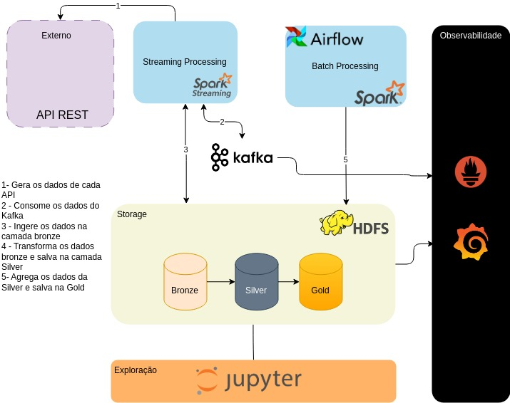

<p align="center" width="100%">
    
</p>

O repositório "datamaster" é um projeto do programa Data Master organizado pela F1rst Santander. 

# **Relatório Técnico**

## **I. Objetivo do Case**

O objetivo do case é desenvolver uma solução de engenharia de dados para consumir informações das APIs de rede sociais em tempo real utilizando a biblioteca Faker para simuular os dados. O fluxo de dados deve ser processado e armazenado em um **Data Lake**, estruturado em camadas (`bronze`, `silver`, `gold`). Além disso, a solução deve permitir **monitoramento** e **observabilidade**, garantindo a rastreabilidade do fluxo de dados, detecção de falhas e identificação de gargalos de desempenho.

### **Inicio Rapido**

#### **Configurando o Ambiente**
   - Execute o comando 
```
   ./start_services.sh 
``` 

Com isso todos os serviços devem estar sendo executados sem problemas

---

## **II. Arquitetura de Solução e Arquitetura Técnica**

### **Arquitetura de Solução**

A solução foi projetada em um pipeline de dados com as seguintes etapas principais:

1. **Extração**:
   - Geração dos dados via biblioteca Faker
   - As informações são enviadas para o tópico no Kafka.

2. **Processamento em Tempo Real**:
   - Dados do Kafka são consumidos pelo PySpark.
   - Os dados são escritos na camada `bronze` do Data Lake.

3. **Transformação e Limpeza**:
   - Dados da camada `bronze` são processados e normalizados para a camada `silver`.

4. **Agregação**:
   - A camada `gold` é criada com agregações e métricas prontas para análise, como KPIs.

5. **Monitoramento**:
   - Métricas de todo o pipeline são monitorados usando Prometheus, Grafana.

---

### **Arquitetura Técnica**

**Tecnologias Utilizadas**:

| Tecnologia        | Função                                                      |
|-------------------|-------------------------------------------------------------|
| **Kafka**         | Sistema de mensageria para ingestão de dados em tempo real. |
| **Kafka Exporter** | Export as metricas do Kafka para o Prometheus               |
| **PySpark**       | Processamento distribuído de dados.                         |
| **HDFS**          | Armazenamento em Data Lake com suporte a grandes volumes.   |
| **Jupyter**       | Ambiente para exploração dos dados                          |
| **Airflow**       | Schedular Jobs                                              |
| **Prometheus**    | Coleta de métricas para monitoramento.                      |
| **Grafana**       | Visualização de métricas em dashboards.                     |
| **Docker Compose** | Orquestração dos serviços.                                  |

**Arquitetura**:



---

## **III. Explicação sobre o Case Desenvolvido**

### **1. Extração de Dados**

O script [run.py](api_fake/run.py) gera os dados de cada Midia Social e envia para os topicos `instagram-post`,`facebook-post`, `x-post`

### **2. Processamento de Dados**

Os script [kafka_to_bronze.py]
- Consome mensagens do Kafka em tempo real nos topicos  `instagram-post`,`facebook-post`, `x-post`.
- Escreve os dados brutos e as metricas de cada etapa na camada `bronze` do Data Lake em formato Parquet.
- Assegura tolerância a falhas com checkpoints.

O script [silver_unified_batch.py](airflow/dags/silver_unified_batch.py)
- DAG que consome a camada bronze e extrai e estrutura as informações mais relevantes.

O script [gold_batch.py](airflow/dags/gold_batch.py)
- DAG que consome a camada silver e realiza agregações.

### **3. Estrutura do Data Lake**

- **Camada Bronze**: Dados brutos conforme recebidos do Kafka.
- **Camada Silver**: Dados transformados e normalizados, por exemplo, extraindo estatísticas individuais dos jogadores.
- **Camada Gold**: Dados agregados, como KPIs (ex.: total de kills, mortes e assistências por jogador).

### **4. Monitoramento**

**Métricas**:
- Kafka, HDFS e Spark expõem métricas para o Prometheus, que são visualizadas no Grafana.

### **4. LGPD**

Para os dados que trabalhamos na API, não temos dados sensiveis.

Caso existise dados sensiveis poderiamos utilizar os metodos:
   - Generalização
   - Supressão
   - K-Anonimidade
   - Tokenização

---

## **IV. Melhorias e Considerações Finais**

### **Melhorias**

1. **Escalabilidade**:
   - Implementar particionamento no Kafka e paralelismo no PySpark para suportar maior volume de dados.
   - Configurar múltiplos nós no cluster HDFS para maior capacidade de armazenamento.

2. **Observabilidade Avançada**:
   - Adicionar rastreamento distribuído com OpenTelemetry para monitorar o tempo de processamento em cada componente do pipeline.

3. **Governança de Dados**:
   - Adicionar políticas de retenção em cada camada.
   - Adicionar expurgo dos dados

4. **Segurança**:
   - Configurar autenticação e autorização no Kafka.
   - Criptografar os dados sensíveis armazenados no Data Lake.
   - Chaves de API ser armazenadas em um cofre de senhas.

---

### **Considerações Finais**

A solução desenvolvida apresenta um pipeline robusto para ingestão, processamento e armazenamento de dados em tempo real, com suporte a monitoramento e observabilidade. As tecnologias utilizadas garantem escalabilidade e flexibilidade, atendendo às demandas do case.
Com as melhorias sugeridas, a solução pode ser ainda mais eficiente e confiável, garantindo maior governança e capacidade de lidar com volumes crescentes de dados.

---
